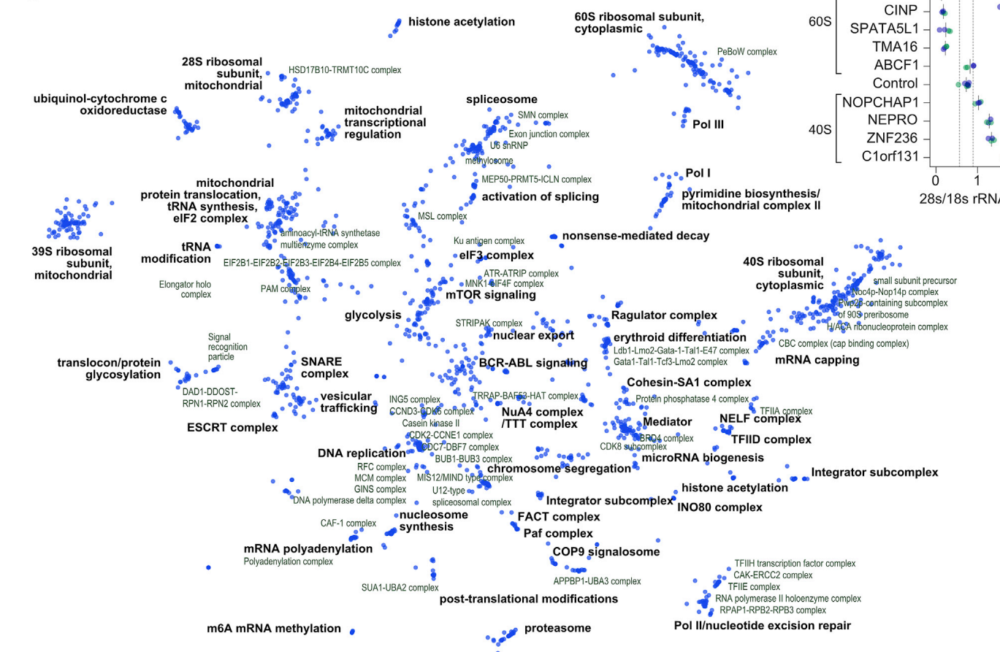
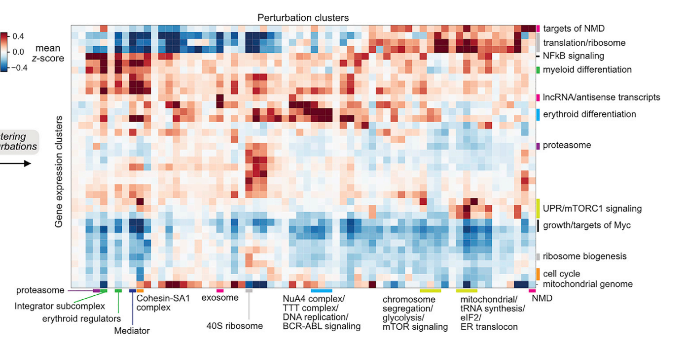

## Terminologies

1.  **Phenotype-centric mapping**: Approach that reveals the genetic changes that drive a phenotype of interest. **Limitations**: Pooled forward genetic screens typically use low-dimensional phenotypes such as growth or marker expression for selection. The use of simple phenotypes can conflate genes acting via different mechanisms, requiring extensive follow-up studies to disentangle genetic pathways. Additionally, in forward genetics, serendipitous discovery is constrained by the prerequisite of selecting phenotypes prior to screening.
2.  **Gene-centric mapping**: Catalogs the diverse phenotypes caused by a defined genetic change. **Limitations**: Typically been restricted in scale to rationally chosen targets, limiting systematic comparisons.
3.  **Incomplete penetrance**: in the context of using the Anderson-Darling test to detect transcriptional changes, it is referring to the fact that not all cells with a genetic perturbation will show the expected changes in gene expression. Some cells might carry the mutation but not exhibit the altered transcriptional phenotype, leading to a mixture of cells with and without the phenotype within the same population. The AD test is useful in this context because it is sensitive enough to detect changes in subsets of cells, thereby identifying differentially expressed genes (DEGs) even when the phenotype is not uniformly penetrant across all cells.

## Rationale

### Genome-scale single-cell CRISPR Screens

In genome-scale single-cell CRISPR screens, the diversity of perturbations allows exploration of the range of cell states that can be revealed by rich phenotypes. Additionally, as many human genes are well characterized, these genes serve as natural controls to anchor interpretation of comprehensive datasets. It explains what fraction of genetic changes elicit transcriptional phenotypes and how transcriptional responses differ between cell types.

Perturb-seq uses scRNA-seq to concurrently read out the CRISPR single-guide RNAs (sgRNAs) (i.e., genetic perturbation) and transcriptome (i.e., high-dimensional phenotype) of single cells in a pooled format.

### Multiplexed CRISPRi strategy

-   Compared with gain-of-function perturbations, a higher proportion of loss-of-function perturbations yield phenotypes in growth and chemical-genetic screens, especially for members of protein complexes.
-   CRISPRi allows direct measurement of the efficacy of genetic perturbation—knockdown—by scRNA-seq. Exploiting this feature allowed us to target each gene in our library with a single element and empirically exclude unperturbed genes from downstream analysis.
-   CRISPRi tends to yield more homogeneous perturbation than CRISPR knockout, which can generate active in-frame indels. The relative homogeneity of CRISPRi reduces selection for unperturbed cells, especially when studying essential genes.
-   Unlike CRISPR knockout, CRISPRi does not lead to activation of the DNA damage response which can alter transcriptional signatures.
-   To maximize CRISPRi efficacy, we used multiplexed CRISPRi libraries in which each element contains two distinct sgRNAs targeting the same gene. **To avoid low representation of sgRNAs targeting essential genes, we performed growth screens and, during oligonucleotide library synthesis, overrepresented constructs that caused strong growth defects, ensuring that critical sgRNAs are adequately represented, and mitigating biases in the screening results.**

### Three-Pronged Perturb-seq Screening Approach

-   Using multiple time points allows for the observation of dynamic changes and temporal effects of gene perturbation. Different cell types can provide insights into cell-specific responses and identify universal versus context-specific gene functions.

-   CML K562 Cells are a well-established model for chronic myeloid leukemia, making them suitable for studying cancer-related gene functions. RPE1 cells are non-cancerous, hTERT-immortalized, and exhibit near-normal chromosomal content, making them a good model for studying non-cancerous cell biology.

-   Screening Methodology: 10x Genomics Droplet-Based 3' scRNA-seq and Direct sgRNA Capture

-   Exclusion of Doublets: Cells with multiple sgRNAs were excluded to avoid confounding effects from multiple gene perturbations. High Coverage: Achieving a median coverage of over 100 cells per perturbation ensures robust statistical power and reliable detection of gene expression changes.

### A robust computational framework to detect transcriptional phenotypes

-   Include many control cells bearing diverse non-targeting sgRNAs. This allows internal z-normalization of measurements to correct for batch effects.

-   Energy Distance Test: A global transcriptional changes test was performed using a permuted energy distance test, comparing cells with genetic perturbations to control cells. Approximately 31.1% of 9,608 perturbations targeting a primary transcript caused significant transcriptional phenotypes in K562 cells. (**Global test**)

-   Anderson-Darling (AD) Test: Used to detect differentially expressed genes (DEGs) with incomplete penetrance, the AD test found 30.5% of perturbations caused \>10 DEGs in K562 cells. (**Multiple test**)

-   Features of Genetic Perturbations: The strength of the transcriptional response correlated with the growth phenotype, and essential perturbations leading to significant transcriptional responses were identified. Notably, many perturbations caused transcriptional changes without affecting growth, indicating an influence on cell state.

### Annotating gene function from transcriptional phenotypes

-   **Core idea: For different genes, if their perturbations have similar transcriptional phenotypes, then their function might be similar. Hence cluster perurbations with similar transcriptional phenotypes.**
-   Use correlation between mean expression profile of gene perturbations as a scale-invariant metric of similarity.
-   Use CORUM3.0 and STRING databese to validate that perturbations with correlated transcriptional profile indicate common function. Identified 327 protein complexes with at least two-thirds of their members present, representing 14,165 confirmed protein-protein interactions. The median expression profile correlation was strong (r = 0.61). High correlation between expression profiles was associated with high STRING protein-protein interaction confidence scores.
-   Perturbation of genes annotated with known functions led to similar transcriptional responses, predicting roles for uncharacterized genes.
-   Selected poorly annotated genes associated with ribosome biogenesis were validated using CRISPRi, confirming their roles in the ribosome. 

### Data-driven definition of transcriptional programs

**Clustering Genes into Expression Programs**

-   Purpose: To identify groups of genes that are co-regulated and likely involved in the same biological processes or pathways.

-   Gene Co-regulation: Genes that are co-regulated tend to be involved in the same cellular processes or pathways. By clustering these genes together, researchers can identify which genes work together and uncover the underlying biological mechanisms.

-   Expression Programs: This clustering helps define transcriptional programs, which are sets of genes that are co-expressed under certain conditions or in response to specific perturbations. Understanding these programs provides insights into how cells respond to various stimuli and perturbations.

**Clustering Perturbations Based on Transcriptional Profiles**

-   Purpose: To categorize the effects of genetic perturbations based on the changes they induce in gene expression.

-   Transcriptional Profiles: Each genetic perturbation can have a unique impact on gene expression. By clustering perturbations with similar transcriptional profiles, researchers can group perturbations that induce similar changes, suggesting they affect similar pathways or processes.

-   Functional Consequences: This clustering helps in understanding the functional consequences of different genetic perturbations. Perturbations that cluster together likely influence the same or related biological pathways, making it easier to infer their roles and effects.

**Combined Benefits**

-   Map of Biological Processes: Combining both types of clustering allows researchers to create a comprehensive map of biological processes and how they are regulated. Clustering genes reveals the biological programs, while clustering perturbations shows how different genetic changes impact these programs.

-   Identifying Key Regulators: By examining which perturbations affect specific gene clusters, researchers can identify key regulators and pathways involved in particular biological functions or responses.

-   Functional Annotation: This dual approach facilitates the functional annotation of genes and perturbations. Genes can be annotated based on the expression programs they belong to, and perturbations can be annotated based on the transcriptional changes they induce.

-   Predicting Gene Function: Clustering genes and perturbations together allows for the prediction of gene function. If a perturbation is known to affect a certain pathway, genes co-regulated in response to this perturbation can be inferred to play roles in that pathway.

